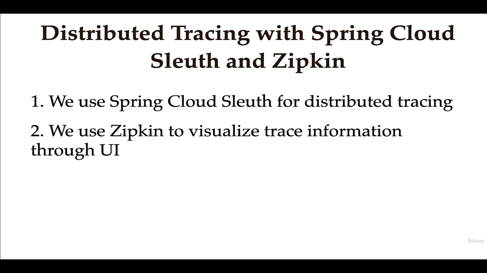
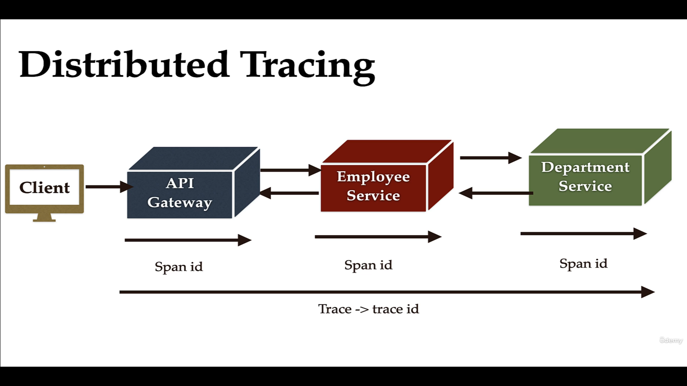
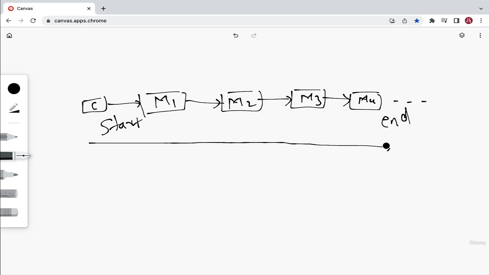
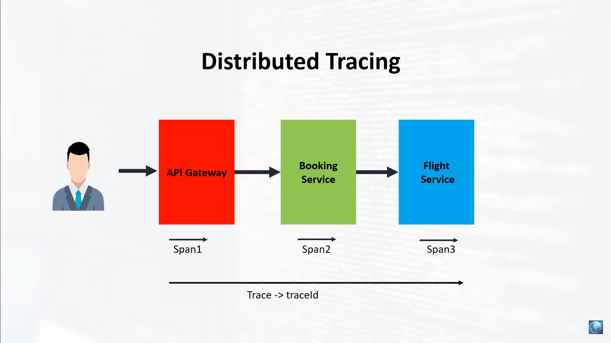
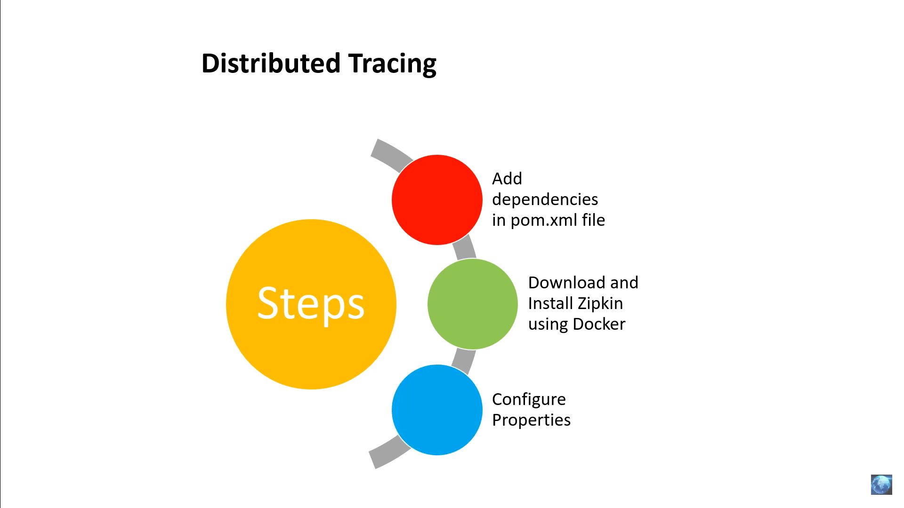

# What Problem Distributed Tracing Solves?






Note : Sleuth has been deprecated for spring boot 3.
To do distributed tracing we need to use Micrometer

# How Distributed Tracing Works





-- Add the Zipkin dependency in the services:
```
<dependency>
      <groupId>org.springframework.boot</groupId>
      <artifactId>spring-boot-starter-actuator</artifactId>
    </dependency>
    <dependency>
      <groupId>io.micrometer</groupId>
      <artifactId>micrometer-tracing-bridge-brave</artifactId>
    </dependency>
    <dependency>
      <groupId>io.zipkin.reporter2</groupId>
      <artifactId>zipkin-reporter-brave</artifactId>
    </dependency>

```
and add the zipkin property in the service : 

```
spring.zipkin.base-url=http://127.0.0.1:9411/
spring.sleuth.sampler.probability=1.0

```

- Run the zipkin jar and call the service api to see the traces in  Zipkin dashboard