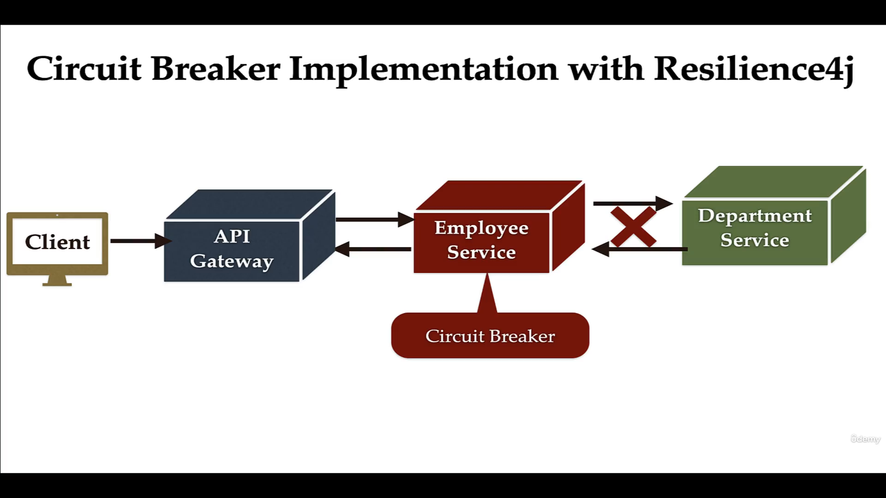
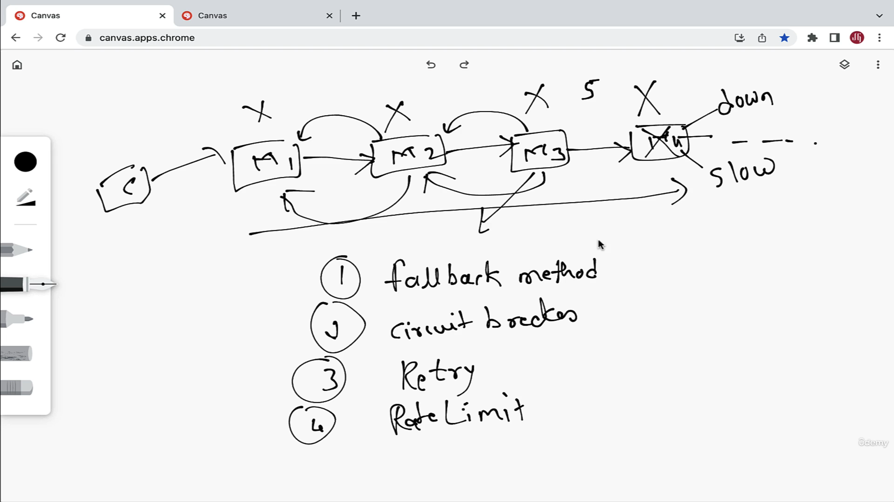
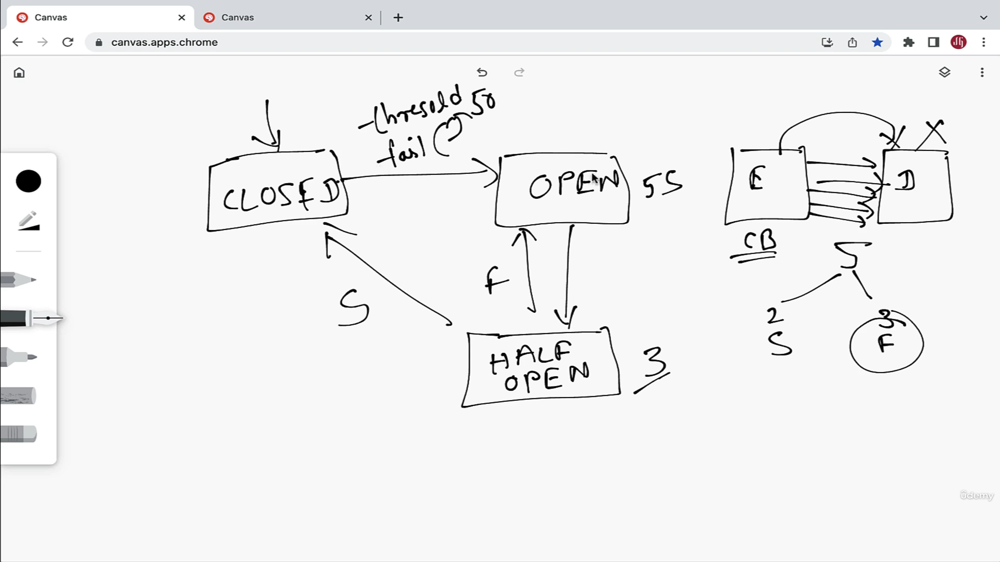
- Circuit Breaker can be implemented by Resilience4j library.
- And we will implement the circuit breaker on the employee service 
as its calling the department service.
so when the employee service calls the department service and the department service is down the employee gets the default value of department.

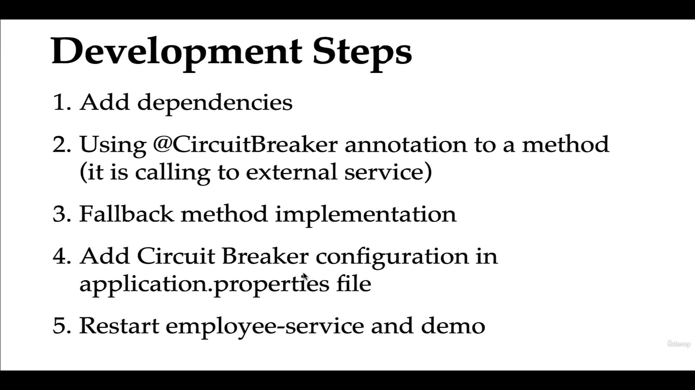

link - 
- https://resilience4j.readme.io/docs/getting-started-3
- https://spring.io/projects/spring-cloud-circuitbreaker

 Dependencies :
 ```
  <dependency>
      <groupId>org.springframework.cloud</groupId>
      <artifactId>spring-cloud-starter-circuitbreaker-resilience4j</artifactId>
    </dependency>

    also add actuator -- it provides health endpoints for circuit breaker

    and aop dependencies and actuator uses aop .


    
	<dependency>
      <groupId>org.springframework.boot</groupId>
      <artifactId>spring-boot-starter-aop</artifactId>
    </dependency>
	


 ```

 - Annotate the circuitbreak on the serivce function which is calling / having the logic which calls the department service 

 ```
@CircuitBreaker(name = "${spring.application.name}", fallbackMethod = "getDefaultDepartment")

	public ApiResponseDTO getEmployeeById(long id) {
		
		Employee employee = employeeRepository.findById(id).get();
		
		log.info("Employee details: "+employee);

//		Rest template
//		ResponseEntity<Department> resoponseEntity = restTemplate.getForEntity("http://localhost:8080/api/departments/code/"+employee.getDepartmentCode() ,Department.class);
//		Department department = resoponseEntity.getBody();
//		log.info("Department details: "+department);
		
//		web client
		
//		ResponseSpec responseSpec = webClient
//		.get()
//		.uri("http://localhost:8080/api/departments/code/"+employee.getDepartmentCode())
//		.retrieve();
//		
//		
//		Department department = responseSpec.bodyToMono(Department.class)
//				.block();//synchronous call
		
		
//open clients
		
		Department department = apiClient.getDepartmentByCode(employee.getDepartmentCode() );
		
		log.info("Department details: "+department);
		ApiResponseDTO apiResponseDTO = ApiResponseDTO.builder().department(department).employee(employee).build();
		
		log.info("apiResponseDTO: "+apiResponseDTO);
		return apiResponseDTO;
	
	
	
	}


 ```


 - Implement the getDefaultDepartment method which will return the default value of department.

 ```
public ApiResponseDTO getDefaultDepartment(long id) {

		Employee employee = employeeRepository.findById(id).get();

		log.info("Employee details: " + employee);

		Department department = new Department();
		department.setDeptName("Default Deptament");
		department.setDescription("Default Description");
		department.setCode("DEFAULT CODE");
		department.setId(1);

		log.info(" Default Department details: " + department);

		ApiResponseDTO apiResponseDTO = ApiResponseDTO.builder().department(department).employee(employee).build();

		log.info("apiResponseDTO: " + apiResponseDTO);
		return apiResponseDTO;

	}

 ```

 - Add circuit breaker props in employee app.prop file :

 ```


# actuator for circuit breaker :
management.health.circuitbreakers.enabled=true
management.endpoints.web.exposure.include=health
management.endpoint.health.show-details=always

#circuit breaker configuration
resilience4j.circuitbreaker.instances.employee-service.registerHealthIndicator=true
#the name we provided the service name in service function
resilience4j.circuitbreaker.instances.employee-service.failure-rate-threshold=50
#Failure rate threshold is 50 % 
resilience4j.circuitbreaker.instances.employee-service.minimumNumberOfCalls=5
#Minumum number of calls 5 default is 100.
resilience4j.circuitbreaker.instances.employee-service.automaticTransitionFromOpenToHalfOpenEnabled=true
resilience4j.circuitbreaker.instances.employee-service.waitDurationInOpenState=5s
#5 seconds 
resilience4j.circuitbreaker.instances.employee-service.permittedNumberOfCallsInHalfOpenState=3
resilience4j.circuitbreaker.instances.employee-service.slidingWindowType=COUNT_BASED
#Sliding window type is count or time based
resilience4j.circuitbreaker.instances.employee-service.slidingWindowSize=10

#link https://resilience4j.readme.io/docs/circuitbreaker


 ```

 - Restart the employee service.

 

-  We  can also see the circuit breaker for employee service :
http://localhost:8081/actuator/health

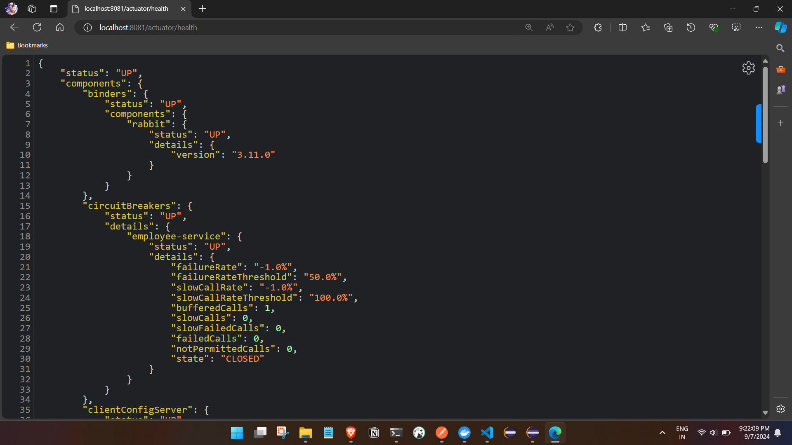

- As of now the services are working fine so the state is in closed state, lets check on other states.
- Stop the department service call again employee service api.


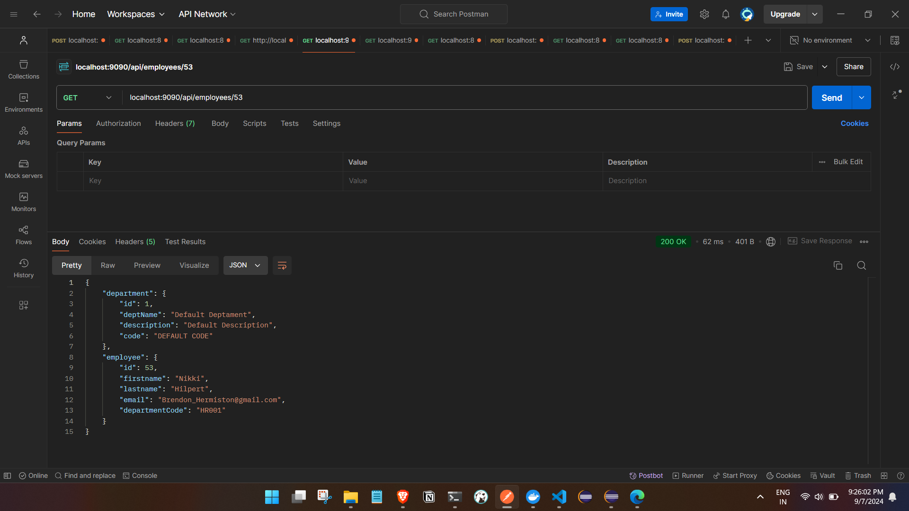

link : localhost:9090/api/employees/53

```
{
    "department": {
        "id": 1,
        "deptName": "Default Deptament",
        "description": "Default Description",
        "code": "DEFAULT CODE"
    },
    "employee": {
        "id": 53,
        "firstname": "Nikki",
        "lastname": "Hilpert",
        "email": "Brendon_Hermiston@gmail.com",
        "departmentCode": "HR001"
    }
}

```

-Now if we see the circuit breaker from actuator , we can see the failed attemnts in the circuit breaker.
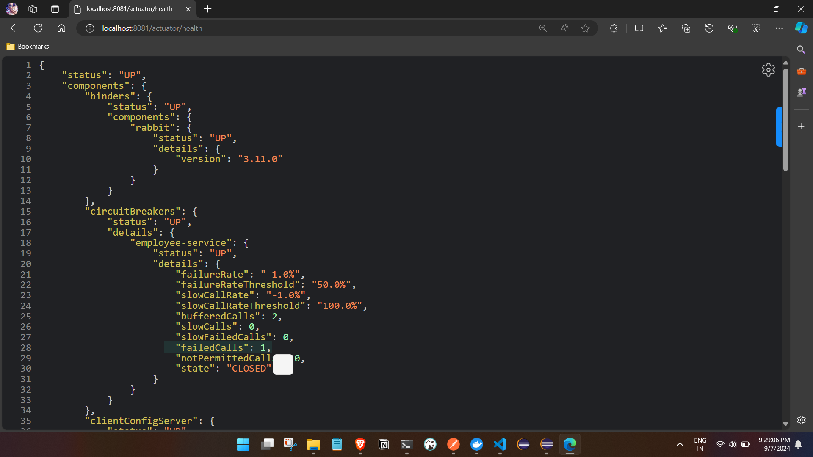
and in properties we had defined
```
resilience4j.circuitbreaker.instances.employee-service.minimumNumberOfCalls=5

```
- Lets call the api 5 more times

- Opened state :


- Now the circuit breaker is in open state but it will move to half open state in 5s 
as we had defined the prop :
```
resilience4j.circuitbreaker.instances.employee-service.waitDurationInOpenState=5s

resilience4j.circuitbreaker.instances.employee-service.automaticTransitionFromOpenToHalfOpenEnabled=true

``` 

- Moving to half open state :
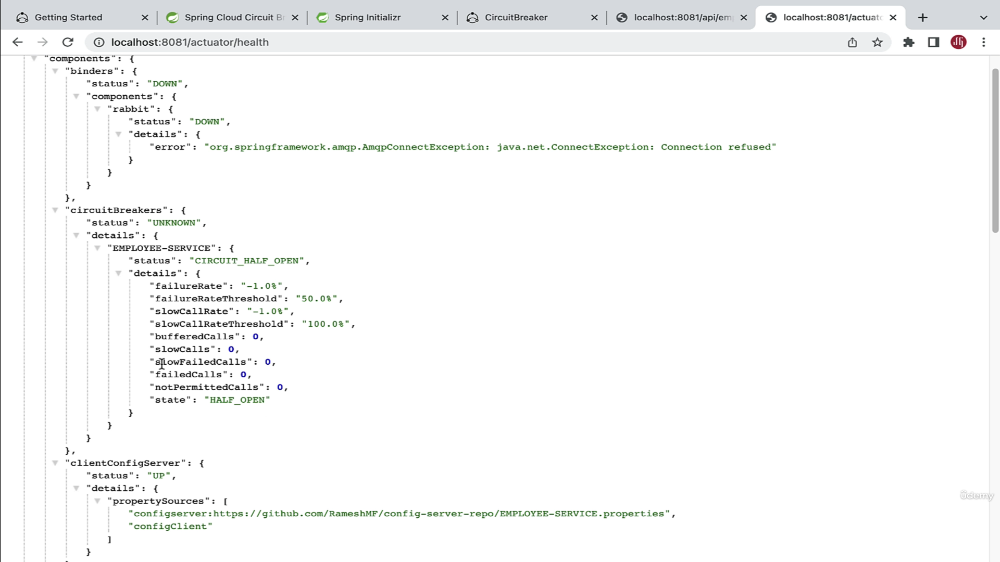
- Now circuit breaker will only allow limited number of calls i.e 3 , lets call it and see 
```
prop :
resilience4j.circuitbreaker.instances.employee-service.permittedNumberOfCallsInHalfOpenState=3

```
 lets call it and see the api to see the circuit breaker will move to closed state or open state.
 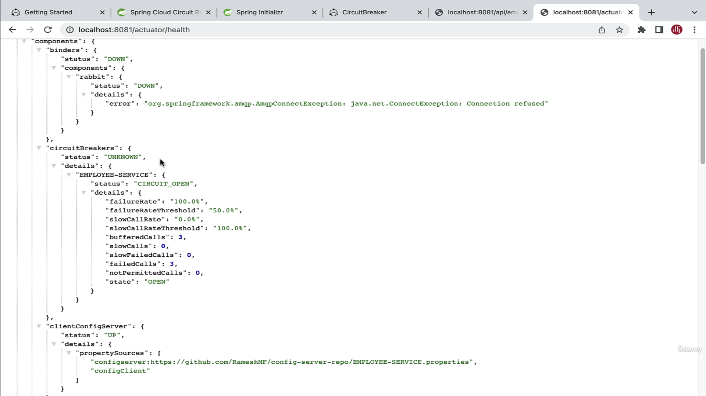

 - Now the state is in open state. now lets move the state to closed state, by starting the department service.
 - Call the api and see the circuit breaker will move to closed state.
 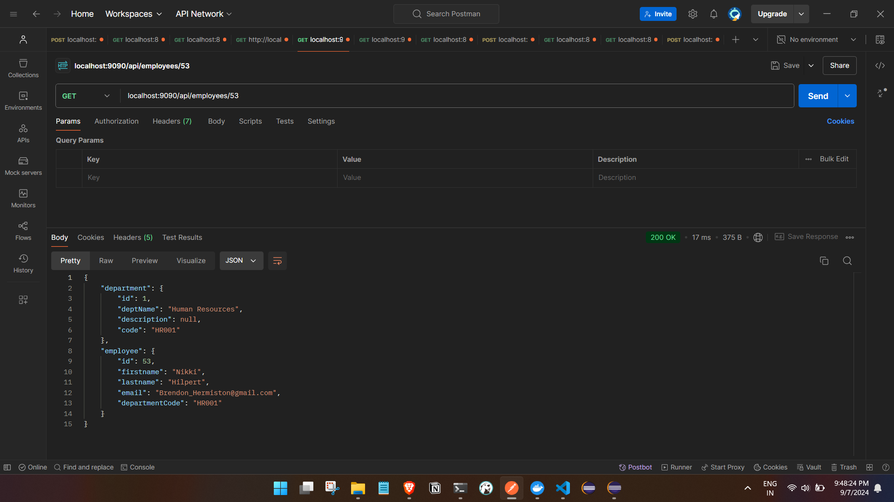
 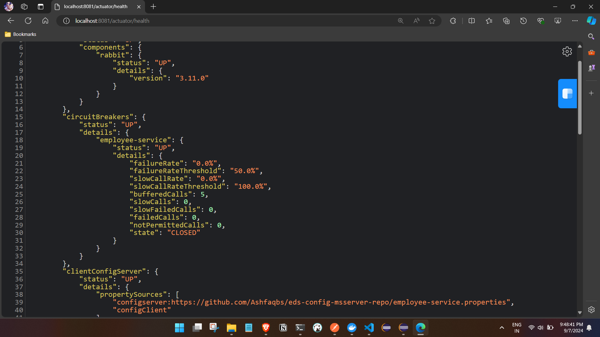

 ##  Retry Pattern Implementation using Resilience4j


 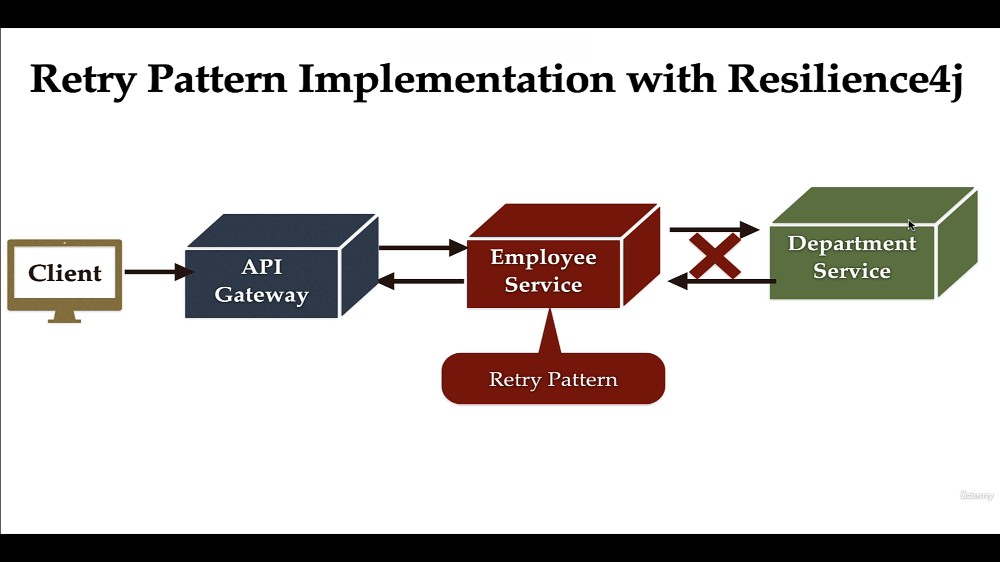

 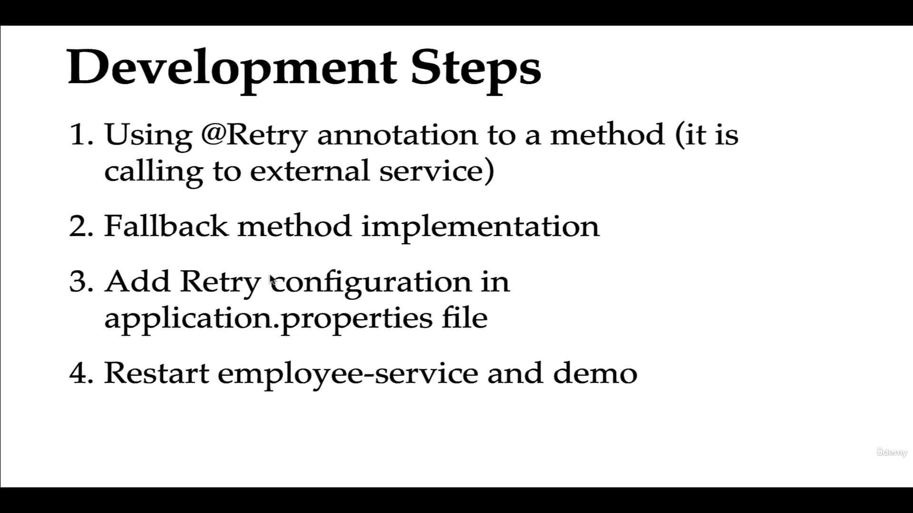

 - Add the retry annotation and prop 

```

//	@CircuitBreaker(name = "${spring.application.name}", fallbackMethod = "getDefaultDepartment")
	@Retry(name = "${spring.application.name}", fallbackMethod = "getDefaultDepartment")
	public ApiResponseDTO getEmployeeById(long id) {

		Employee employee = employeeRepository.findById(id).get();

		log.info("Employee details: " + employee);

//		Rest template
//		ResponseEntity<Department> resoponseEntity = restTemplate.getForEntity("http://localhost:8080/api/departments/code/"+employee.getDepartmentCode() ,Department.class);
//		Department department = resoponseEntity.getBody();
//		log.info("Department details: "+department);

//		web client

//		ResponseSpec responseSpec = webClient
//		.get()
//		.uri("http://localhost:8080/api/departments/code/"+employee.getDepartmentCode())
//		.retrieve();
//		
//		
//		Department department = responseSpec.bodyToMono(Department.class)
//				.block();//synchronous call

//open clients

		Department department = apiClient.getDepartmentByCode(employee.getDepartmentCode());

		log.info("Department details: " + department);
		ApiResponseDTO apiResponseDTO = ApiResponseDTO.builder().department(department).employee(employee).build();

		log.info("apiResponseDTO: " + apiResponseDTO);
		return apiResponseDTO;

	}

    public ApiResponseDTO getDefaultDepartment(long id, Exception e) {

		Employee employee = employeeRepository.findById(id).get();

		log.info("Employee details: " + employee);

		Department department = new Department();
		department.setDeptName("Default Deptament");
		department.setDescription("Default Description");
		department.setCode("DEFAULT CODE");
		department.setId(1);

		log.info(" Default Department details: " + department);

		ApiResponseDTO apiResponseDTO = ApiResponseDTO.builder().department(department).employee(employee).build();

		log.info("apiResponseDTO: " + apiResponseDTO);
		return apiResponseDTO;

	}


    - Add circuit breaker props in employee app.prop file :


    # Retry configuration
resilience4j.retry.instances.EMPLOYEE-SERVICE.registerHealthIndicator=true
resilience4j.retry.instances.EMPLOYEE-SERVICE.maxAttempts=5
resilience4j.retry.instances.EMPLOYEE-SERVICE.waitDuration=2s


```

- Bring down the department service and call the api :
- Tries 5 time to call the api every 2 seconds and if failed goes for the fallback method.
- Add loggers in service function to see the retry count.

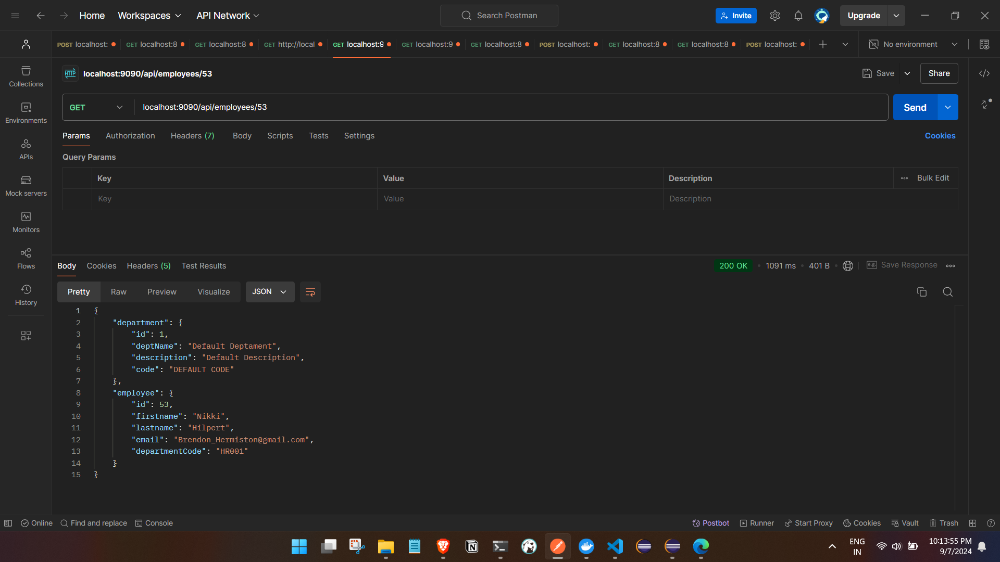
