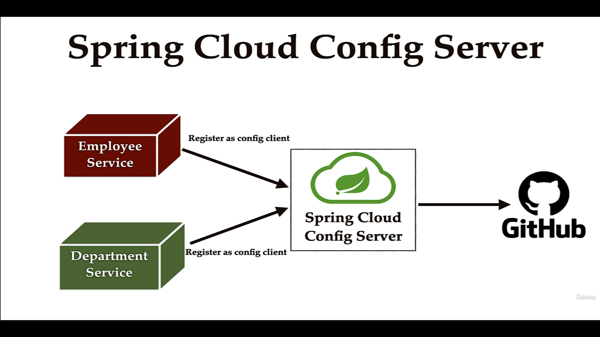
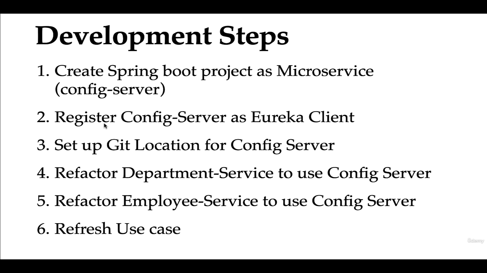
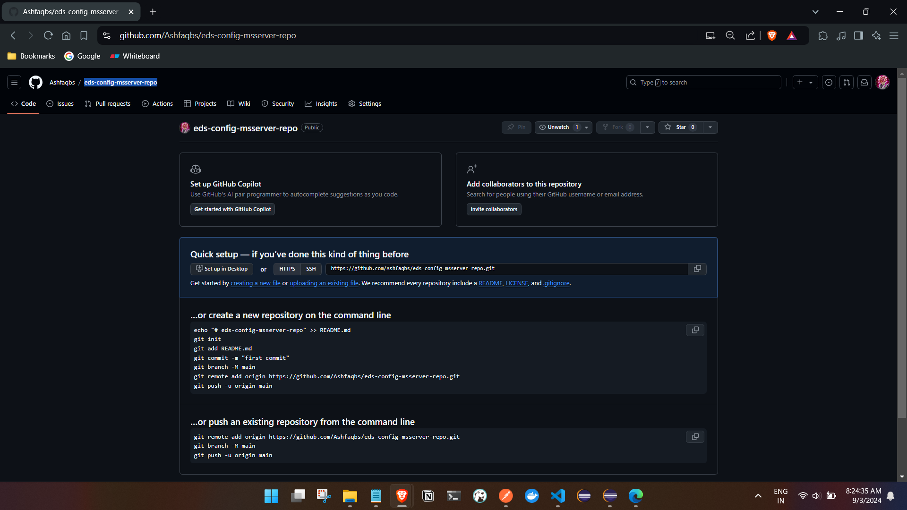

# Centralized Configurations using Spring Cloud Config Server




We will keep the configuration in a git repository for our services.

- 1st Creating a project 

```
Dependencies : 

<properties>
		<java.version>21</java.version>
		<spring-cloud.version>2023.0.3</spring-cloud.version>
	</properties>


<dependencies>
		<dependency>
			<groupId>org.springframework.boot</groupId>
			<artifactId>spring-boot-starter-actuator</artifactId>
		</dependency>
		<dependency>
			<groupId>org.springframework.cloud</groupId>
			<artifactId>spring-cloud-config-server</artifactId>
		</dependency>
		<dependency>
			<groupId>org.springframework.cloud</groupId>
			<artifactId>spring-cloud-starter-netflix-eureka-client</artifactId>
		</dependency>

		<dependency>
			<groupId>org.springframework.boot</groupId>
			<artifactId>spring-boot-devtools</artifactId>
			<scope>runtime</scope>
			<optional>true</optional>
		</dependency>
		<dependency>
			<groupId>org.springframework.boot</groupId>
			<artifactId>spring-boot-starter-test</artifactId>
			<scope>test</scope>
		</dependency>
	</dependencies>


    	<dependencyManagement>
		<dependencies>
			<dependency>
				<groupId>org.springframework.cloud</groupId>
				<artifactId>spring-cloud-dependencies</artifactId>
				<version>${spring-cloud.version}</version>
				<type>pom</type>
				<scope>import</scope>
			</dependency>
		</dependencies>
	</dependencyManagement>


```

2nd annotate the main class with @EnableConfigServer

```
import org.springframework.boot.SpringApplication;
import org.springframework.boot.autoconfigure.SpringBootApplication;
import org.springframework.cloud.client.discovery.EnableDiscoveryClient;
import org.springframework.cloud.config.server.EnableConfigServer;

@SpringBootApplication
@EnableConfigServer
@EnableDiscoveryClient
public class EdsConfigServerApplication {

	public static void main(String[] args) {
		SpringApplication.run(EdsConfigServerApplication.class, args);
	}

}

```
3rd setup git repository 

create a repository : eds-config-msserver-repo link - https://github.com/Ashfaqbs/eds-config-msserver-repo



4th setup the application properties : 

```
spring.application.name=eds-config-server


eureka.client.serviceUrl.defaultZone=http://localhost:8761/eureka

server.port=8888
#provide the git repo url
spring.cloud.config.server.git.uri=https://github.com/Ashfaqbs/eds-config-msserver-repo
#this configuration will clone the repo on start-up
spring.cloud.config.server.git.clone-on-start=true
#in github we typically see two branches master and main , we will keep the master branch as default
spring.cloud.config.server.git.default-label=master

```