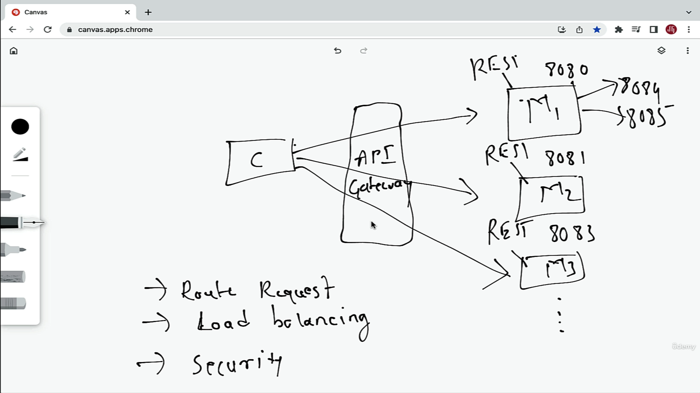

# API Gateway


* Register the API Gateway to the Eureka server.


### Rough Architecture




## Configuring API Gateway Routes and Test using Postman Client

* We can configure the routes two ways 
1. In Properties
2. Configuration Class


### In Properties

1. ID of the service 

```
#service name taken from eureka UI 
spring.cloud.gateway.mvc.routes[0].id=EMPLOYEE-SERVICE

```

2. URI of the service 

```

#no need to provide the actual url/path we can provide the service name for load balancing
#spring.cloud.gateway.mvc.routes[0].uri=http://localhost:8081

#OR imbuilt load balancer provided by netflix eureka 
spring.cloud.gateway.mvc.routes[0].uri=lb://EMPLOYEE-SERVICE
```


3. Predicates of the service

```
#Configuring the predicates 
spring.cloud.gateway.mvc.routes[0].predicates[0]=Path=/api/employees/**

```
* Similarly we can configure the routes for other services.


## Using Spring Cloud Gateway to Automatically Create Routes for the Services


- API Gateway properties file : 
```

# automatically configuring the routes

# 1st enable the discovery locator :
spring.cloud.gateway.discovery.locator.enabled=true

#we configure the service  in upper case this will convert it to lowercase
spring.cloud.gateway.discovery.locator.lower-case-service-ids=true

#Debug logs
#logging.level.org.springframework.cloud.gateway.handler.RoutePredicateHandlerMapping=TRACE
logging.level.org.springframework.cloud.gateway=DEBUG


#Note : This way of calling wont work 
#localhost:9090/api/departments/code/IT00 
# We have to provide with service Id 

http://localhost:9090/employee-service/api/employees/90

similarly call the department service

```