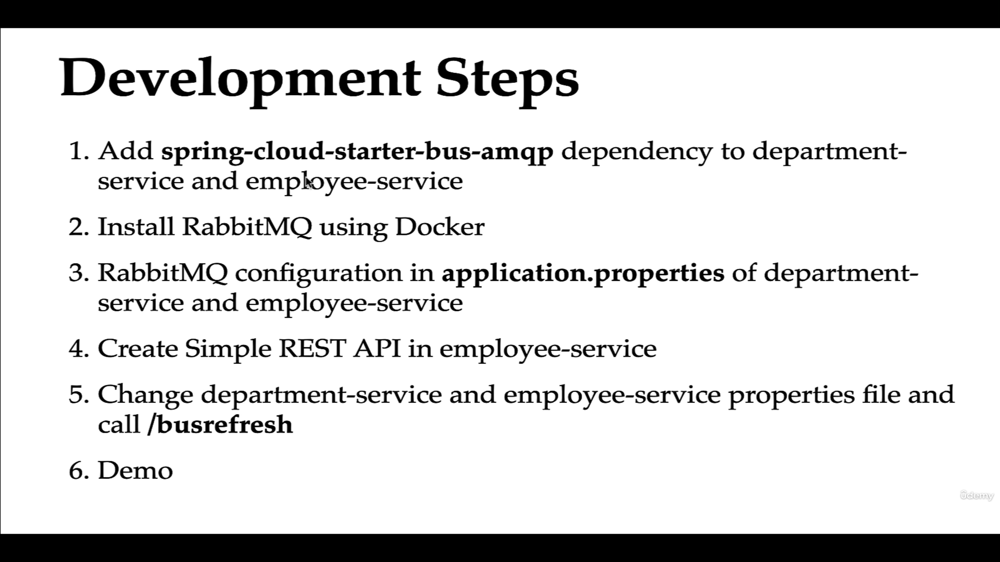

# Centralized Configurations using Spring Cloud Config Server


We will keep the configuration in a git repository for our services.

- 1st Creating a project 

```
Dependencies : 

<properties>
		<java.version>21</java.version>
		<spring-cloud.version>2023.0.3</spring-cloud.version>
	</properties>


<dependencies>
		<dependency>
			<groupId>org.springframework.boot</groupId>
			<artifactId>spring-boot-starter-actuator</artifactId>
		</dependency>
		<dependency>
			<groupId>org.springframework.cloud</groupId>
			<artifactId>spring-cloud-config-server</artifactId>
		</dependency>
		<dependency>
			<groupId>org.springframework.cloud</groupId>
			<artifactId>spring-cloud-starter-netflix-eureka-client</artifactId>
		</dependency>

		<dependency>
			<groupId>org.springframework.boot</groupId>
			<artifactId>spring-boot-devtools</artifactId>
			<scope>runtime</scope>
			<optional>true</optional>
		</dependency>
		<dependency>
			<groupId>org.springframework.boot</groupId>
			<artifactId>spring-boot-starter-test</artifactId>
			<scope>test</scope>
		</dependency>
	</dependencies>


    	<dependencyManagement>
		<dependencies>
			<dependency>
				<groupId>org.springframework.cloud</groupId>
				<artifactId>spring-cloud-dependencies</artifactId>
				<version>${spring-cloud.version}</version>
				<type>pom</type>
				<scope>import</scope>
			</dependency>
		</dependencies>
	</dependencyManagement>


```

2nd annotate the main class with @EnableConfigServer

```
import org.springframework.boot.SpringApplication;
import org.springframework.boot.autoconfigure.SpringBootApplication;
import org.springframework.cloud.client.discovery.EnableDiscoveryClient;
import org.springframework.cloud.config.server.EnableConfigServer;

@SpringBootApplication
@EnableConfigServer
@EnableDiscoveryClient --register to eureka
public class EdsConfigServerApplication {

	public static void main(String[] args) {
		SpringApplication.run(EdsConfigServerApplication.class, args);
	}

}

```
3rd setup git repository 

create a repository : eds-config-msserver-repo link - https://github.com/Ashfaqbs/eds-config-msserver-repo


4th setup the application properties : 

```
spring.application.name=eds-config-server

--register to eureka
eureka.client.serviceUrl.defaultZone=http://localhost:8761/eureka

server.port=8888

#provide the git repo url
spring.cloud.config.server.git.uri=https://github.com/Ashfaqbs/eds-config-msserver-repo

#this configuration will clone the repo on start-up
spring.cloud.config.server.git.clone-on-start=true

#in github we typically see two branches master and main , we will keep the master branch as default
spring.cloud.config.server.git.default-label=main

```

5th Step Register the service with config server :

- add dependency in pom.xml for the services: 

```
    <dependency>
      <groupId>org.springframework.cloud</groupId>
      <artifactId>spring-cloud-starter-config</artifactId>
    </dependency>


  <dependency>
      <groupId>org.springframework.boot</groupId>
      <artifactId>spring-boot-starter-actuator</artifactId>
    </dependency>


	Add Actuator if not added as well
```

- Add project specific properties in servicename.properties file  in the config server repo :


1. Department Service

- create a file department-service.properties in the repo and paste all the department service properties


similarly for other services .

note : In services we have to remove or comment out the properties which we have used as the properties will be referred from repo , but let the service name be and the congig server url  .

eg : 

```
#the config server will check the name of the services so let is stay

spring.application.name=department-service
spring.config.import=optional:configserver:http://localhost:8888


#Properties moved to config server repo
## MySQL configuration (primary)
#spring.datasource.url=jdbc:mysql://localhost:3306/data_schema
#spring.datasource.username=root
#spring.datasource.password=admin
#spring.datasource.driver-class-name=com.mysql.cj.jdbc.Driver
#
# 
#
##jpa/hibernate configuration  
#spring.jpa.show-sql=true
#spring.jpa.hibernate.ddl-auto=update
##spring.jpa.properties.hibernate.dailect=org.hibernate.dialect.MySQLDialect
#
#
##Eureka client / service registry configuration
#
#eureka.client.serviceUrl.defaultZone=http://localhost:8761/eureka


```
- same for employee services

- Start the services to test the config server: 

# AutoReload for the properties change 

* When ever we change the configuration of these services it should automatically be updated and no need to reload the services.


- Add the @RefreshScope on the @RestController 
```

@RefreshScope
@RestController
public class MessageController {

	@Value("${message}")
	private String message;
	
	@GetMapping("/message")
	public String getMessage() {
		return this.message;
	}
	
}
```

- Make the changes in github 
```

employee-service.properties

message=welcome to the emp service updated two

```
- Call the api :  

post : localhost:8081/actuator/refresh 
this will refresh the config server


- Call the main api :

localhost:8081/message


-Note if refreshed data is not showing up try restarting the service and then call the actuator api and then api .

- But there is a issue when we change the properties in the config server repo.
We have to call the acutator refresh api for the respective service.


## Spring Cloud Bus 



- Add the cloud bus dependency in employee service and department service:
```
<!--Bus config -->
 <dependency>
      <groupId>org.springframework.cloud</groupId>
      <artifactId>spring-cloud-starter-bus-amqp</artifactId>
    </dependency>

``` 

- Add RabitMQ using Docker :
```
docker pull rabbitmq:3.11.0

docker run --rm -it -p 5671:5672 rabbitmq:3.11.0

```
This command starts a new Docker container from the rabbitmq:3.11.0 image. It runs in an interactive terminal mode (-it), automatically removes the container when it stops (--rm), and maps port 5671 of the host machine to port 5672 of the RabbitMQ container, allowing communication with RabbitMQ over port 5672.

Why These Options Are Important
--rm: Saves disk space by removing containers that are no longer needed.
-it: Enables interactive access, useful for debugging or configuring the service.
-p: Essential for exposing services running inside the container to the host network.


- Add the rabbitmq property in services:

```
--this are the default values for the rabbitmq properties
spring.rabbitmq.host=localhost
spring.rabbitmq.port=5671
spring.rabbitmq.username=guest
spring.rabbitmq.password=guest
```


- We had alrady created a rest api copy the same in department service and add the propety in department service (adding the rabbitmq properties and dependency should be done already)

api- localhost:8080/message
 


change the data in repo and again without restarting the service call the api to verify :

Again call the post api : localhost:8080/actuator/busrefresh

and call the api : localhost:8080/message

```
Welcome to department service updated
```

