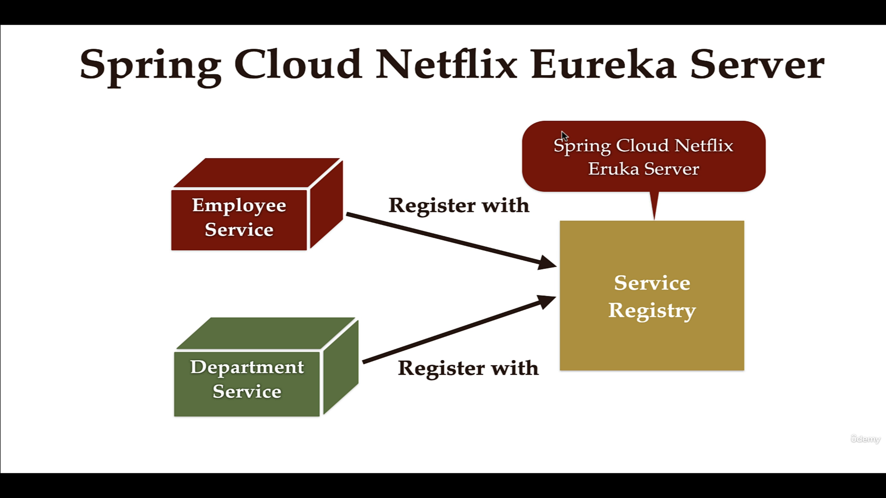

## Service Registry





```
1 - create the project 

add dependencies: 


    <properties>
		<java.version>21</java.version>
		<spring-cloud.version>2023.0.3</spring-cloud.version>
	</properties>

    <dependency>
			<groupId>org.springframework.cloud</groupId>
			<artifactId>spring-cloud-starter-netflix-eureka-server</artifactId>
		</dependency>


        <dependencyManagement>
		<dependencies>
			<dependency>
				<groupId>org.springframework.cloud</groupId>
				<artifactId>spring-cloud-dependencies</artifactId>
				<version>${spring-cloud.version}</version>
				<type>pom</type>
				<scope>import</scope>
			</dependency>
		</dependencies>
	</dependencyManagement>


-- Main Application

@SpringBootApplication
@EnableEurekaServer
public class EdsServiceRegistryApplication {

	public static void main(String[] args) {
		SpringApplication.run(EdsServiceRegistryApplication.class, args);
	}

}


--Application Properties


spring.application.name=eds-service-registry


server.port=8761

eureka.client.register-with-eureka=false
eureka.client.fetch-registry=false


```


- Register the services  with Eureka Server
```

eg: For department-service

add dependencies:

<properties>
		<java.version>21</java.version>
		    <spring-cloud.version>2023.0.3</spring-cloud.version>

	</properties>


 <dependency>
      <groupId>org.springframework.cloud</groupId>
      <artifactId>spring-cloud-starter-netflix-eureka-client</artifactId>
    </dependency>


    
	<dependencyManagement>
    <dependencies>
      <dependency>
        <groupId>org.springframework.cloud</groupId>
        <artifactId>spring-cloud-dependencies</artifactId>
        <version>${spring-cloud.version}</version>
        <type>pom</type>
        <scope>import</scope>
      </dependency>
    </dependencies>
  </dependencyManagement>


add the annotation :

@SpringBootApplication
@EnableDiscoveryClient
public class DeptartmentServiceApplication {

	public static void main(String[] args) {
		SpringApplication.run(DeptartmentServiceApplication.class, args);
	}

}


Application Properties :

eureka.client.serviceUrl.defaultZone=http://localhost:8761/eureka


```

We should see the service registred in Eureka Server.


do the same for the employee service 


###  Running Multiple Instances of DepartmentService

we will run the department service 2 instances 

create the jar file and run them on diffrenct ports (cmd clean package)

run the command where the jar is present : 
```
cmd 
java -jar -Dserver.port=8082 jarfile.jar


C:\Users\ashfa\OneDrive\Desktop\My-Learning\Java\Code\SB-Microservices\enterprise-data-system-MSarch-SB3J21\deptartment-service\target>


java -jar -Dserver.port=8082 deptartment-service-0.0.1-SNAPSHOT.jar

once the projects run test api on both the instances :

localhost:8082/api/departments/code/IT001

And 

localhost:8080/api/departments/code/IT001

```

- refresh the eureka server and we can see the multiple instances running for department service

Note:
we can run multiple instances for the same service


Running one more instance for the same service on port 8089


### Load balancing between the department services:
- As the employee service is calling the department service and department service has 2 instances , the one instance is down due to some issue it should be able to call the other instance of the department service.

- Load Balancing with Eureka, Open Feign and Spring Cloud LoadBalancer:


- i.e employee service should be able to call the department service which is available so out of 2 instances one is down or not available due to some issues 
it shoud be able to call the other instance of the department service.

- we have to use spring cloud load balancer to achieve this and this is provided by spring cloud eureka client .


```
//@FeignClient(url = "http://localhost:8080",value = "Department-service")//providing the base urls of the service and defining the name
//feign client library will dynamically create an implementation class for this interface

//Above we cannot have loadbalane on the department service as only on service url is passed as a parameter
//to load balance we can pass the service name it self and the api call will

@FeignClient(name = "DEPTARTMENT-SERVICE")//name of the service
public interface APIClient {

	@GetMapping("/api/departments/code/{code}")
	 Department getDepartmentByCode(@PathVariable String code);
	
}


Testing :

      Call the api : localhost:8081/api/employees/90 


and see the department service instance's logs 

and also bring down one instance of the department service for eg :8089

and reload the eureka server and test the api .
  
   Call the api : localhost:8081/api/employees/90 

tested 


```

