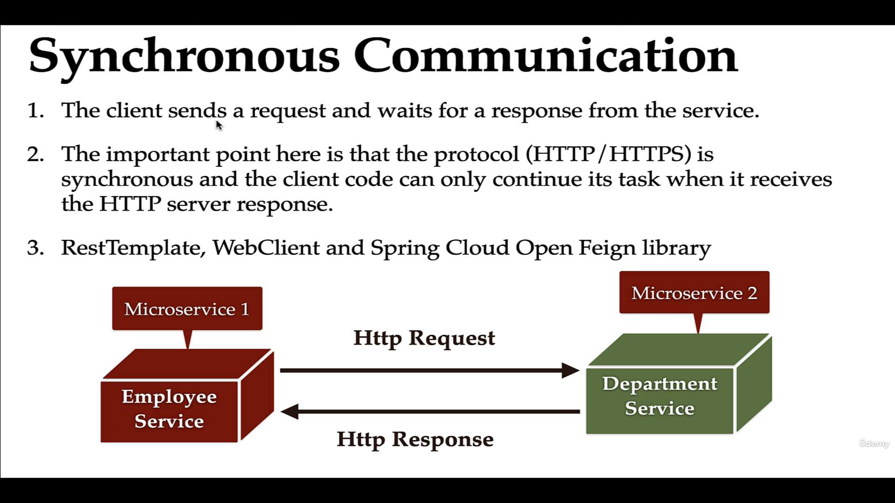
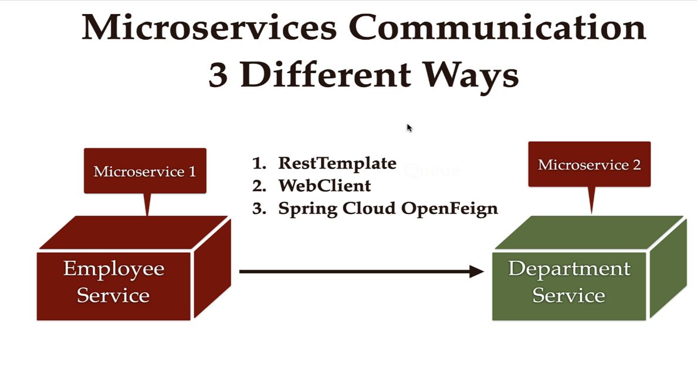
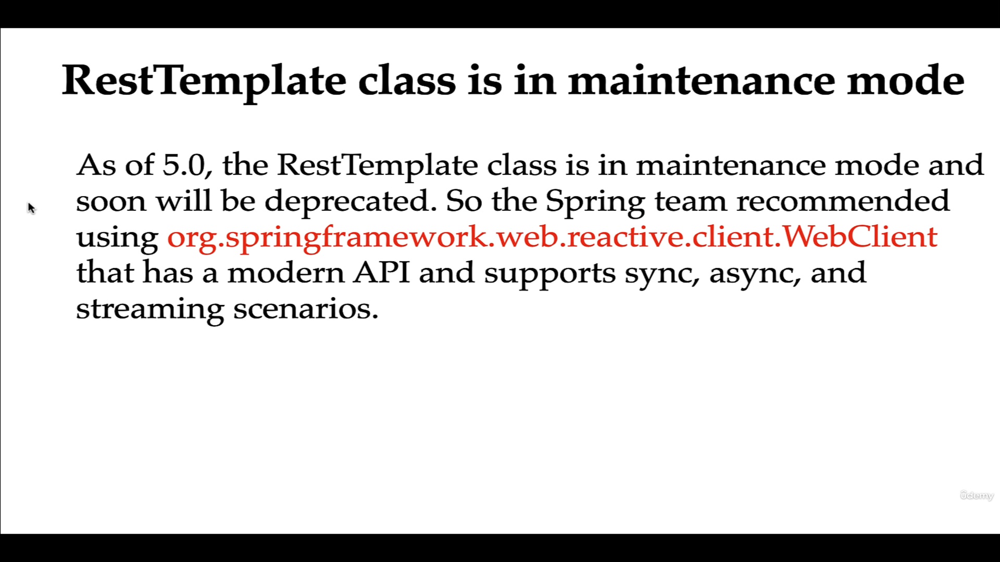
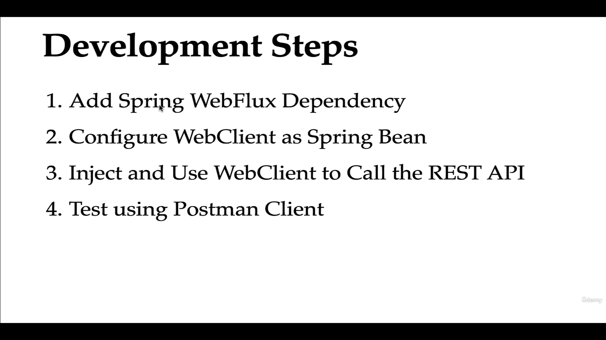
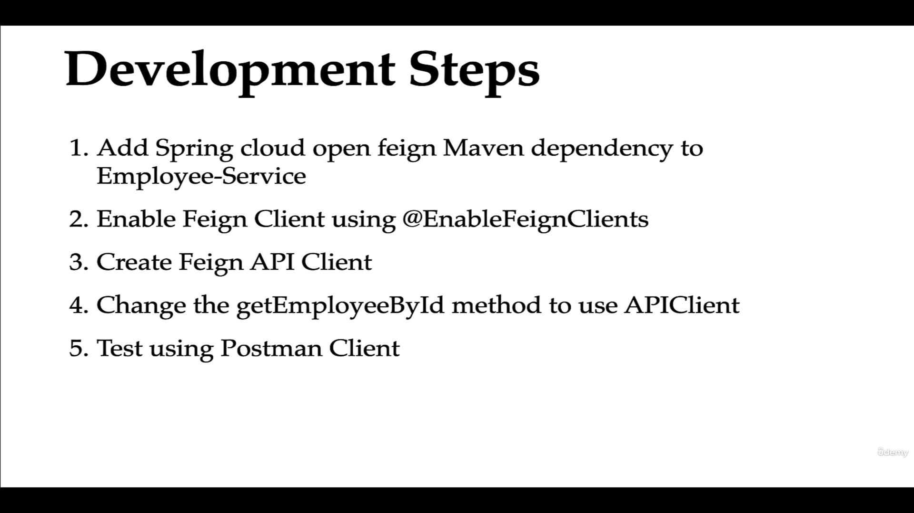
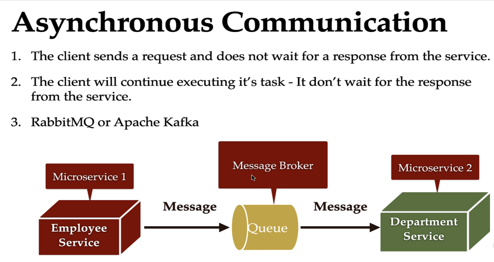

# Enterprise Management Microservices Architecture 

- We have a Microservices Architecture where we have three services Employee Services  Department Services and Organization Services And Employee Services call the department services

 ### Services Communication Types

1. Synchronous communication between services
 - Can be achieved using RestTemplate, WebClient and OpenFeign Library


 




Eg :  
```
Entity 

1 

From Department Service

@Data
@Entity
@Table(name = "department")
@AllArgsConstructor
@NoArgsConstructor
public class Department {

	@Id
	@GeneratedValue(strategy = GenerationType.IDENTITY)
	private Long id;
	private String deptName;
	private String description;
	private String code;
}


2 

From Employee Service


@Entity
@Table(name = "ms_employee")
@Data
@NoArgsConstructor
@AllArgsConstructor
public class Employee {

	@Id
	@GeneratedValue(strategy = GenerationType.AUTO)
	private long id;
	private String firstname;
	private String lastname;

	@Column(unique = true, nullable = false)
	private String email;
	
	private String departmentCode; 
    
    we will call the api which gives us department from department code and take the code and 
    pass it to employee class as well
}


Note :  The varaibles should be  same in both Department classes.

@Data
@NoArgsConstructor
@AllArgsConstructor
public class Department {

	private long id;
	private String deptName;
	private String description;
	private String code;

	
}


3 Final Response DTO : 


@Data
@AllArgsConstructor
@NoArgsConstructor
@Builder
public class ApiResponseDTO {
	
	private Department department;
	private Employee employee;

}


Working : 

a - RestTemplate 


	public ApiResponseDTO getEmployeeById(long id) {
		
		Employee employee = employeeRepository.findById(id).get();
		
		log.info("Employee details: "+employee);

		ResponseEntity<Department> resoponseEntity = restTemplate.getForEntity("http://localhost:8080/api/departments/code/"+employee.getDepartmentCode() ,Department.class);
		
		Department department = resoponseEntity.getBody();
		log.info("Department details: "+department);
		ApiResponseDTO apiResponseDTO = ApiResponseDTO.builder().department(department).employee(employee).build();
		
		log.info("apiResponseDTO: "+apiResponseDTO);
		return apiResponseDTO;
	
	
	
	}

* We have configured RestTemplate as bean to use it.

And this is mapped to a controller 
Sample call :

http://localhost:8081/api/employees/90


response :

{
"department": {
"id": 2,
"deptName": "IT",
"description": null,
"code": "IT001"
},
"employee": {
"id": 90,
"firstname": "Vicenta",
"lastname": "Heidenreich",
"email": "Margarete_Bruen@yahoo.com",
"departmentCode": "IT001"
}
}
  


```

Note For RestTemplate : 


b - Need to use WebClient instead of rest template


This supports synchronous, asynchronous communication and streaming sceanarios as well.
and this is a part of spring webflux denedency.



```
1.  Add the webflux dependency in pom.xml

		<dependency>
			<groupId>org.springframework.boot</groupId>
			<artifactId>spring-boot-starter-webflux</artifactId>
		</dependency>


2. create a config class with webclient bean
		
		@Configuration
		public class Config {

	// as restTemplate is in maintence mode, so commenting this bean
//	@Bean
//	public RestTemplate restTemplate() {
//		return new RestTemplate();
//	}

	@Bean
	public WebClient webClient() {
		return WebClient.builder().build();
	}

		}


3. Use the webclient 


@Service
@Slf4j
public class EmployeeService {

	@Autowired
	private EmployeeRepo employeeRepository;
	
//	@Autowired
//	private RestTemplate restTemplate;


	@Autowired
	private WebClient webClient ;
	
	
	public ApiResponseDTO getEmployeeById(long id) {
		
		Employee employee = employeeRepository.findById(id).get();
		
		log.info("Employee details: "+employee);

//		Rest template
//		ResponseEntity<Department> resoponseEntity = restTemplate.getForEntity("http://localhost:8080/api/departments/code/"+employee.getDepartmentCode() ,Department.class);
//		Department department = resoponseEntity.getBody();
//		log.info("Department details: "+department);
		
//		web client

		
		
		ResponseSpec responseSpec = webClient
		.get()
		.uri("http://localhost:8080/api/departments/code/"+employee.getDepartmentCode())
		.retrieve();
		
		
		Department department = responseSpec.bodyToMono(Department.class)
				.block();//synchronous call
		
		
		
		log.info("Department details: "+department);
		ApiResponseDTO apiResponseDTO = ApiResponseDTO.builder().department(department).employee(employee).build();
		
		log.info("apiResponseDTO: "+apiResponseDTO);
		return apiResponseDTO;
	
	
	
	}
	
..other methods
	
}

```


c -  Service communication with spring cloud openfeign:

openfeign lib needs spring cloud dependency.



```
1. 
			<properties>
			<java.version>21</java.version>
		    <spring-cloud.version>2023.0.3</spring-cloud.version>
			</properties>


	
		 <dependency>
      <groupId>org.springframework.cloud</groupId>
      <artifactId>spring-cloud-starter-openfeign</artifactId>
   		 </dependency>


add the spring cloud dependency as well 

 <dependencyManagement>
    <dependencies>
      <dependency>
        <groupId>org.springframework.cloud</groupId>
        <artifactId>spring-cloud-dependencies</artifactId>
        <version>${spring-cloud.version}</version>
        <type>pom</type>
        <scope>import</scope>
      </dependency>
    </dependencies>
  </dependencyManagement>


2. Add the @EnableFeignClients to the main class

@SpringBootApplication
@EnableFeignClients//ENABLEs component scanning for interfaces that declare they are Feign Clients
public class EmployeeServiceApplication {

	public static void main(String[] args) {
		SpringApplication.run(EmployeeServiceApplication.class, args);
	}

}


3. Create a interface and define the method  from where we want to call the api , i.e from the employee service

for eg : we were calling an api http://localhost:8080/api/departments/code/{code}

i.e 

ResponseEntity<Department> resoponseEntity = restTemplate.getForEntity("http://localhost:8080/api/departments/code/"+employee.getDepartmentCode() ,Department.class);


so copy the same api method from the department service

@GetMapping("/code/{code}")
	public Department getDepartmentByCode(@PathVariable String code) {
		return departmentService.findByCode(code);
	}


and paste in the interface and modify as: 

package com.ashfaq.dev.service;

@FeignClient(url = "http://localhost:8080",value = "Department-service")//providing the base url
//feign client library will dynamically create an implementation class for this interface
public interface APIClient {

	@GetMapping("/api/departments/code/{code}")
	 Department getDepartmentByCode(@PathVariable String code);
	
}


//open clients

EmployeeService{
//3
	@Autowired
	private APIClient  apiClient ;
	


		
		Department department = apiClient.getDepartmentByCode(employee.getDepartmentCode() );
		
		log.info("Department details: "+department);
		ApiResponseDTO apiResponseDTO = ApiResponseDTO.builder().department(department).employee(employee).build();


}


Test the api : localhost:8081/api/employees/90

```
2. Asynchronous communication between services





